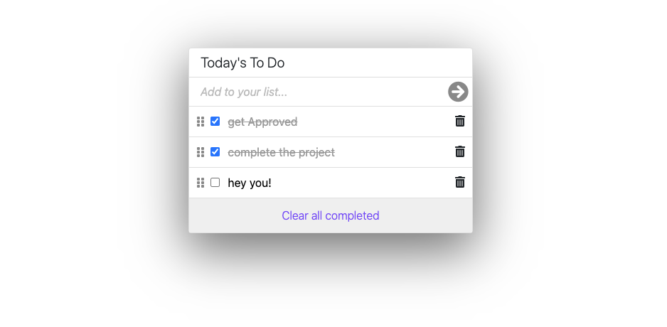

# To Do list

> The project I have built is based on a simple app which adds tasks, marks them as completed and deletes all completed tasks. This project has been built with the help of modern CSS3, Bootstrap 5, JavaScript and webpack to bundle JavaScript. Check the live demo to try.



### Live Demo

[Live Demo Link](https://ibrohimrasulov.github.io/ToDo-List-App/dist)

## Built With

- JavaScript, HTML, CSS
- Webpack

### Prerequisites
    - node

### Setup
```
- npm install
- npm install webpack webpack-cli --save-dev
```

### Clone the repository to your local machine
```
- git clone https://github.com/IbrohimRasulov/ToDo-List-App.git
```

### Deployment
 run:
 ```
 npm run build
 ```
 and deploy the files in the ```dist``` folder

## Authors

👤 **Ibrohim Rasulov**

- GitHub: [@IbrohimRasulov](https://github.com/IbrohimRasulov)
- Twitter: [@IbrohimRasu1ov](https://twitter.com/IbrohimRasu1ov)
- LinkedIn: [LinkedIn](https://www.linkedin.com/in/ibrohim-rasulov-a88352209/)

## 🤝 Contributing

Contributions, issues, and feature requests are welcome!

Feel free to check the [issues page](https://github.com/IbrohimRasulov/ToDo-List-App/issues).

## Show your support

Give a ⭐️ if you like this project!

## Acknowledgments

- Hat tip to anyone whose code was used
- Inspiration
- etc